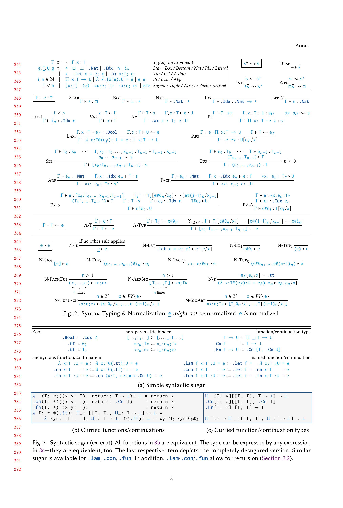

# Soundness

We prove soundness of MimIR by proving progress and preservation properties.

Axioms and normalization are handled before code generation, and thus, are not included in MimIR's runtime system.

In a second step, we show type preservation of normalization ensuring its soundness.
Furthermore, this approach validates the usage of any type preservation axioms.

## Technicalities

We use named unique variables building and make use of the autosubst library for handling substitutions.

Libraries:
- [coq-autosubst](https://github.com/coq-community/autosubst)
- coq-iris (and stdpp)

## References

- Semantics
  - [Code](https://gitlab.mpi-sws.org/FP/semantics-2023)
    - [STLC (Simply Typed Lambda Calculus)](https://gitlab.mpi-sws.org/FP/semantics-2023/-/tree/main/theories/type_systems/stlc?ref_type=heads)
    - [System F](https://gitlab.mpi-sws.org/FP/semantics-2023/-/tree/main/theories/type_systems/systemf?ref_type=heads)
- [Software Foundation](https://softwarefoundations.cis.upenn.edu/)
  - [Programming Language Foundations](https://softwarefoundations.cis.upenn.edu/plf-current/index.html)
    - [STLC (Simply Typed Lambda Calculus)](https://softwarefoundations.cis.upenn.edu/plf-current/Stlc.html)
      - [Progress and Preservation](https://softwarefoundations.cis.upenn.edu/plf-current/StlcProp.html)
- [Lemmas about CC (Calculus of Constructions)](https://hbr.github.io/Lambda-Calculus/cc-tex/cc.pdf)

## Semantics

